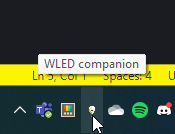

# wled-companion

Companion app for WLED modules that allows quick change of settings and presets from context menu activated from windows system tray icon. Application will automatically detect WLED nodes in local network during initialization.

# Icon

# Context menu

# Automatic module discovery screen

