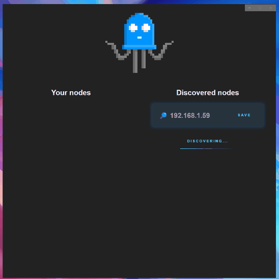

# wled-companion
Companion app for WLED modules that allows quick change of settings and presets from context menu activated with windows system tray icon.

# context menu

# Module discovery screen

